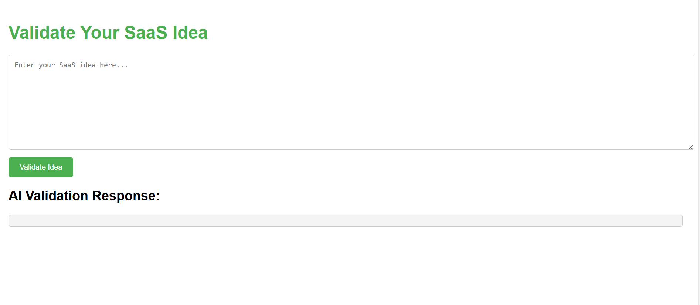
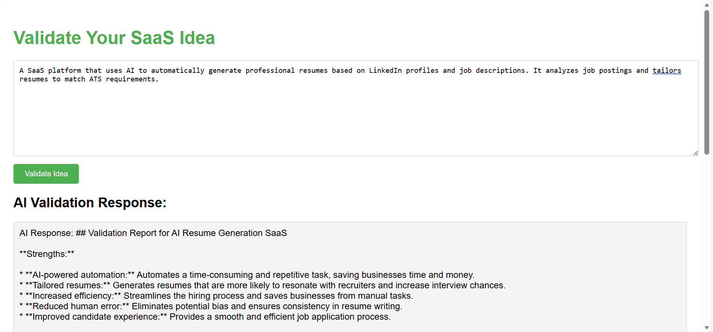

### 🚀💡 SaaS Idea Validator 

**Got a killer SaaS idea?** 🤔✨
Let the AI genius (powered by Ollama) analyze it and give you a detailed breakdown—highlighting your idea’s superpowers, its weak spots, opportunities to shine, and hidden threats. Ready to see if your idea is the next big thing? 🔥💥

### 📚 Table of Contents 

- [About](#about)
- [Features](#features)
- [Tech Stack](#tech-stack)
- [Installation](#installation)
- [Usage](#usage)
- [API](#api)
- [Future Improvements](#future-improvements)

## 🧠✨About

Welcome to SaaS Idea Validator! 🚀 Whether you're in the brainstorming phase or have a solid SaaS product in mind, this tool is here to give you some AI-powered feedback. 🚨 Using a local Ollama AI model, this app dives deep into your idea and provides a validation report with strengths, weaknesses, opportunities, and threats (SWOT analysis). Think of it as your personal idea coach. 🏅

Built with Node.js and Express, the app is easy to set up, lightweight, and offers a super-quick, hassle-free validation process.

## 🔥Features

- Enter your idea: Type it into a simple, user-friendly interface ✍️

- AI-powered feedback: Detailed SWOT analysis to help improve your idea 📊

- Backend API: RESTful API to interact with the AI model 🛠️

- Simplicity at its best: Frontend built with HTML, CSS, and Vanilla JavaScript for quick performance 💻

- Instant feedback: Get an analysis within seconds ⚡

## 🛠️Tech Stack

- Node.js 🌍 – Backend runtime environment

- Express.js 🚀 – Fast and minimalist web framework

- Ollama AI Model 🤖 – The brains behind the validation process

- Vanilla JavaScript, HTML, CSS 💅 – Simple, no-frills frontend

- node-fetch 🌐 – API communication between your app and Ollama

## Home page 


## Output page 



## 🔧Installation

1. Clone the repository:

```bash
    git clone https://github.com/ShashankGowni/saas-idea-validator.git
    cd saas-idea-validator
```

2. Install the dependencies:

```bash
    npm install
```

3. Run the Ollama AI server locally at ```bash http://localhost:11434.``` 🔌

4. Start the server:
```bash
    node server.js
```

5. Open your browser and go to:

```bash
    http://localhost:3000 🌍
```


## 🎯Usage 

- Enter your SaaS idea in the text input box ✍️

- Click "Validate Idea" to send your idea for analysis ✅

- Get an AI-powered validation report with feedback on your idea 📈

- Review the insights and adjust your idea accordingly to increase its chances of success! 💪

### 📡API 

**POST /validate**

Request Body (JSON):

```bash
{
  "idea": "Insert your bold and brilliant SaaS idea here!"
}
```

Response Body (JSON):

```bash
{
"response": "AI-generated validation report text..."
}
```

## 🚀Future Improvements 

- User authentication: Allow users to track and save their ideas and feedback 🔐

- Frontend overhaul: Enhance the interface with modern frameworks like React or Vue.js 🎨

- Database integration: Store ideas and reports for future reference 📚

- Cloud deployment: Deploy to cloud platforms for remote access ☁️

- Customizable AI prompts: Tailor the AI’s responses to specific needs 🎯

## Output


**Created with 💻 and Passion by Gowni Shashank**
**August 2025 🌍**